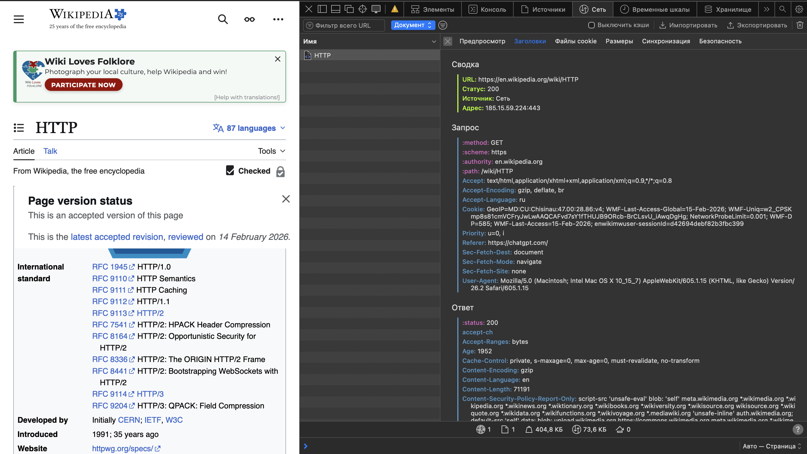
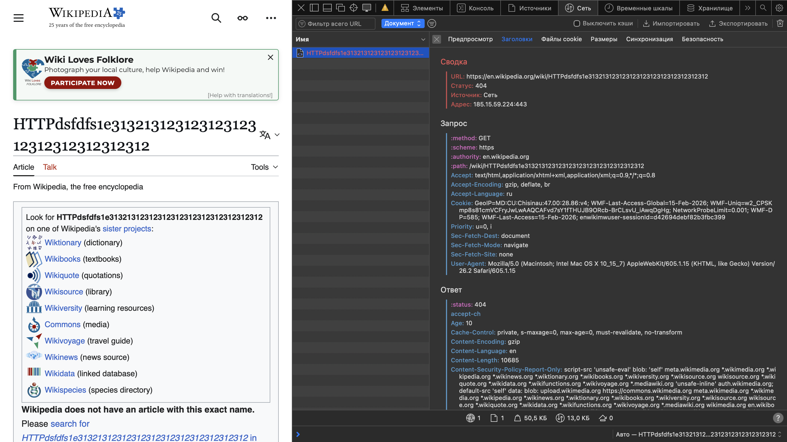
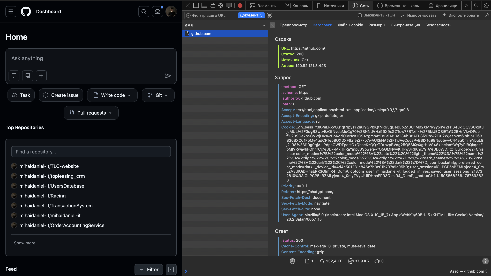

# Лабораторная работа №1  
# HTTP

## Студент: Mihai Daniel  
## Дисциплина: PHP  
## Тема: Анализ HTTP-запросов  

# 1. Цель работы

- Понять, как работает HTTP-протокол.
- Научиться анализировать HTTP-запросы в браузере.
- Разобраться в методах GET, POST, PUT, DELETE.
- Научиться составлять HTTP-запросы вручную.

# 2. Анализ HTTP-запросов (Wikipedia)

## 2.1 Открытая страница

## Скриншот запроса

## URL запроса

https://en.wikipedia.org/wiki/HTTP

## Метод запроса

GET

### Почему используется GET?

Метод GET используется, потому что:
- Запрашивается ресурс (HTML-страница)
- Данные не изменяются
- Сервер только возвращает информацию

## Статус ответа

200 OK

### Что означает 200?

Сервер успешно обработал запрос и вернул страницу.

## Заголовки запроса (Request Headers)

Примеры:
Host: en.wikipedia.org
User-Agent: Mozilla/5.0
Accept: text/html
Accept-Language: en-US

### Назначение заголовков:

| Заголовок | Назначение |
|------------|------------|
| Host | Указывает домен сервера |
| User-Agent | Информация о браузере |
| Accept | Типы данных, которые клиент может принять |
| Accept-Language | Предпочитаемый язык |

## Заголовки ответа (Response Headers)

Пример:
HTTP/1.1 200 OK
Content-Type: text/html
Content-Length: 25442
Server: mw

| Заголовок | Назначение |
|------------|------------|
| Content-Type | Тип возвращаемых данных |
| Content-Length | Размер ответа |
| Server | Информация о сервере |

## Тело запроса и ответа

- Тело запроса отсутствует (GET не содержит body).
- Тело ответа содержит HTML-код страницы.

## Дополнительные запросы при загрузке страницы

После загрузки основного документа браузер отправляет запросы на:

- CSS-файлы
- JavaScript-файлы
- Изображения
- Шрифты

Это необходимо для корректного отображения страницы.

# 2.2 Несуществующая страница

https://en.wikipedia.org/wiki/HTTPdsfdfs

## Скриншот

## Статус ответа

404 Not Found

### Почему?

Сервер не нашёл запрашиваемый ресурс.

# 3. Анализ поиска (Wikipedia Search)

Страница:

https://en.wikipedia.org/wiki/Special:Search

Поиск: **browser**

## Скриншот

## URL запроса

https://en.wikipedia.org/w/index.php?search=browser&title=Special:Search

## Метод запроса

GET

### Почему используется GET?

- Поиск не изменяет данные на сервере.
- Параметры передаются через URL.
- Запрос можно сохранить в закладки.

## Query Parameters

| Параметр | Значение | Назначение |
|----------|----------|------------|
| search | browser | Поисковый запрос |
| title | Special:Search | Служебный параметр |

# 4. Анализ сайта GitHub

https://github.com

## Скриншот

## Основные параметры

- Метод: GET
- Статус: 200 OK
- Content-Type: text/html

Дополнительно выполняются API-запросы и загрузка статических файлов.

# 5. Составление HTTP-запросов

## 5.1 GET-запрос

GET / HTTP/1.1
Host: sandbox.usm.com
User-Agent: Mihai Daniel

### Что такое User-Agent?

User-Agent — это HTTP-заголовок, который:
- сообщает серверу информацию о клиенте
- используется для аналитики
- может применяться для адаптации ответа

## 5.2 POST-запрос

POST /cars HTTP/1.1
Host: sandbox.usm.com
Content-Type: application/x-www-form-urlencoded
make=Toyota&model=Corolla&year=2020

Метод POST используется для создания нового ресурса.

## 5.3 PUT-запрос

PUT /cars/1 HTTP/1.1
Host: sandbox.usm.com
User-Agent: Mihai Daniel
Content-Type: application/json
{
"make": "Toyota",
"model": "Corolla",
"year": 2021
}

PUT полностью заменяет ресурс.

# 6. Разница между PUT и PATCH

| PUT | PATCH |
|------|--------|
| Полное обновление | Частичное обновление |
| Требует передачу всего объекта | Передаются только изменяемые поля |

# 7. Возможный ответ сервера

HTTP/1.1 201 Created
Content-Type: application/json
{
"id": 1,
"make": "Toyota",
"model": "Corolla",
"year": 2020
}

# 8. Возможные коды состояния

| Код | Значение | Когда используется |
|------|----------|-------------------|
| 200 | OK | Успешный запрос |
| 201 | Created | Ресурс создан |
| 400 | Bad Request | Ошибка в данных |
| 401 | Unauthorized | Требуется авторизация |
| 403 | Forbidden | Доступ запрещён |
| 404 | Not Found | Ресурс не найден |
| 500 | Internal Server Error | Ошибка сервера |

# 9. Дополнительные теоретические сведения

## Что такое HTTP?

HTTP — это протокол передачи гипертекста, используемый для обмена данными между клиентом и сервером.

## HTTP является Stateless

Каждый запрос независим. Сервер не хранит состояние между запросами.

## Разница HTTP и HTTPS

HTTPS — защищённая версия HTTP, использующая TLS-шифрование.

# 10. Вывод

В ходе лабораторной работы был изучен механизм работы HTTP-протокола, методы запросов, структура заголовков и коды состояния.  
Также были проанализированы реальные HTTP-запросы в браузере через DevTools.

Полученные знания позволяют понимать, как происходит взаимодействие клиента и сервера в веб-приложениях.

